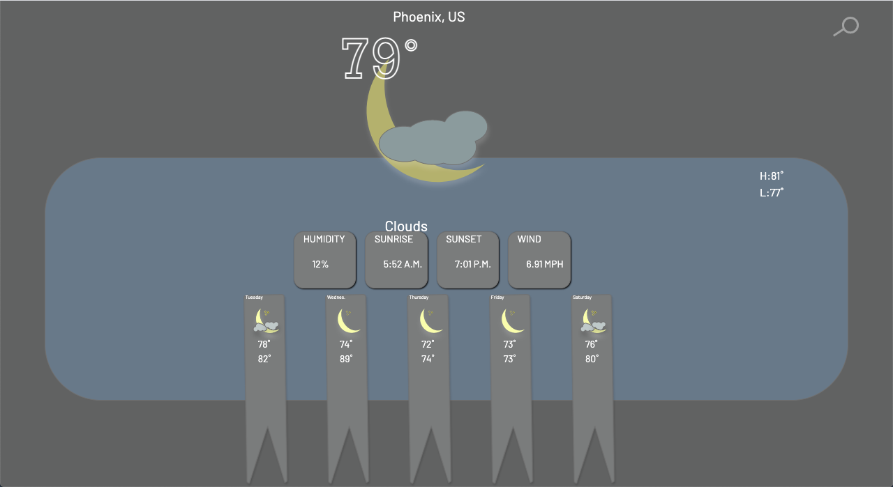
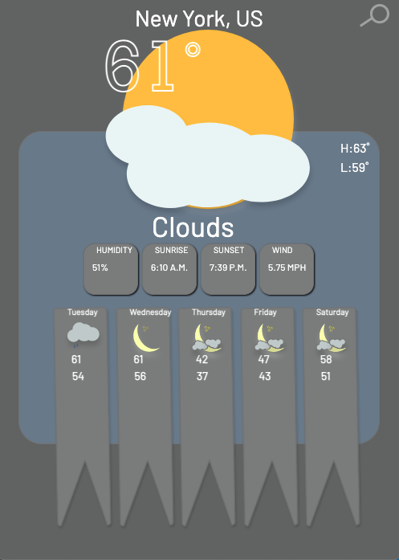
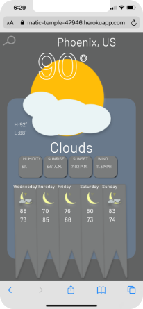

# Weather or Not

  Weather web application, search a city and fetch the JSON objects from the Open Weather Map API. A query displays the current temperature, sunrise and sunset, wind speed, humidity, the current weather condition with a corresponding custom icon. Also displayed is the five day weather forecast and the temperature highs and lows of each day.  

### Technologies
- HTML/CSS
- Javascript
- Node.js
- Express
- EJS
- Open Weather Map API

